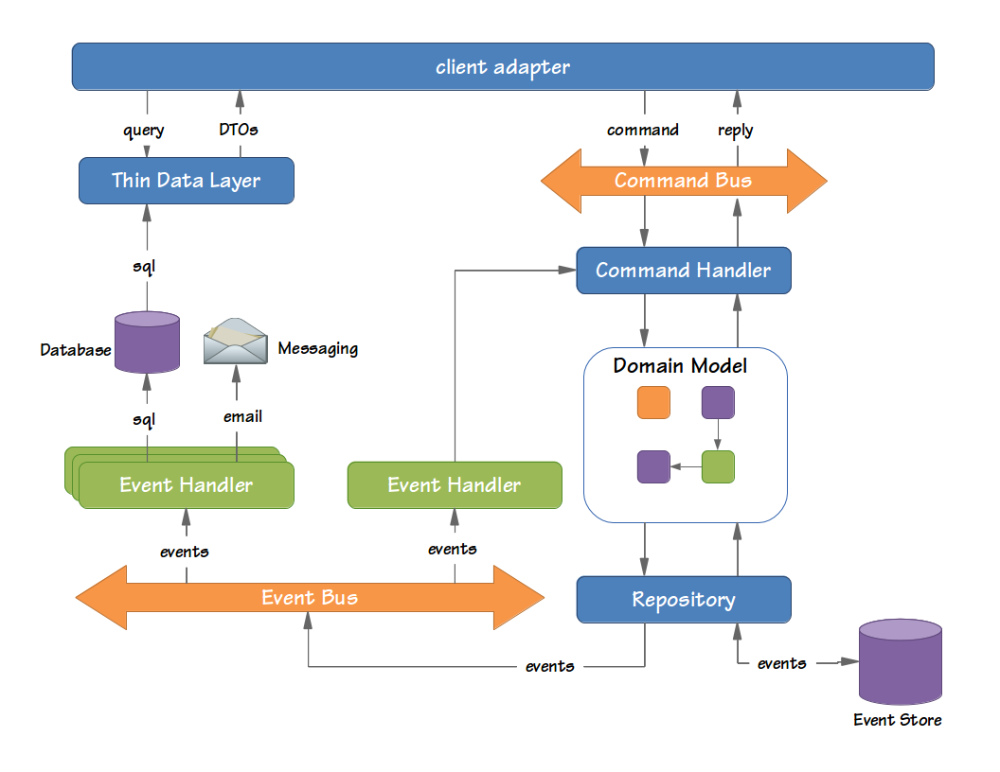

# Architecture

The Biobank application uses a hexagonal architecture to interface to internal and external
clients, external services, and for data storage. The figure below shows the how the ports are
configured. Web browser based clients access the application via the internal client port. A RESTful
interface is also supported to allow the Biobank scanning client access via the external client
port. External systems can also access the application via this port. Biobank can communicate to
external services by using the external services port. The figure also shows that the event store
and query databases are accessed via dedicated ports.

The client ports shown in the figure shown above are managed by client adapters. These client
adapters then interface to the rest of the system via the **Command Bus** and the
**Query Interface**
provided by the **Thin Data Layer** . The figure below shows a more detailed view of the application.
It is the architecture recommended by the Eventsourced Framework.

##Command Handling

Commands are typically represented by simple and straightforward objects that contain all data
necessary for a command handler to execute it. A command expresses its intent by its name. In Scala
terms, that means the class name is used to figure out what needs to be done, and the fields of the
command provide the information required to do it.

The Command Bus receives commands and routes them to the Command Handlers. Each command handler
responds to a specific type of command and executes logic based on the contents of the command. In
some cases, however, logic is executed regardless of the actual type of command, such as validation,
logging or authorization.

##Domain Model

The command handler retrieves domain objects (Aggregates) from a repository and executes methods on
them to change their state. These aggregates typically contain the actual business logic and are
responsible for guarding their own invariants. The state changes of aggregates result in the
generation of Domain Events. Both the Domain Events and the Aggregates form the domain model.

##Repositories and Event Stores

Repositories are responsible for providing access to aggregates. Typically, these repositories are
optimized for look up of an aggregate by its unique identity. Repositories store the state changes
that the aggregate has gone through in an Event Store. The repository is also responsible for
persisting the changes made to aggregates in its backing storage.

##Event Processing

The event bus dispatches events to all interested event handlers. This is done synchronously or
asynchronously. Asynchronous event dispatching allows the command execution to return and hand over
control to the user, while the events are being dispatched and processed in the background. Not
having to wait for event processing to complete makes an application more responsive. Synchronous
event processing, on the other hand, is simpler and is a sensible default. Synchronous processing
also allows several event listeners to process events within the same transaction.

Event handlers receive events from the event bus. Some handlers update data sources used for
querying while others send messages to external systems. Command handlers are completely unaware of
the components that are interested in the changes they make. This means that it is very
non-intrusive to extend the application with new functionality. All you need to do is add another
event handler. The events loosely couple all components in your application together.

In some cases, event processing requires new commands to be sent to the application. The saga is
the CQRS concept responsible for managing these complex business transactions.

##Querying for data

The thin data layer in between the client adapters and the data sources provides a clearly defined
interface to the actual query implementation used. This data layer typically returns read-only Data
Transfer Objects (DTOs) containing query results. The contents of these DTOs are typically driven by
the needs of the client adapters. In most cases, they map directly to a specific view in the UI
(also referred to as table-per-view).

---

[Back to top](../README.md)